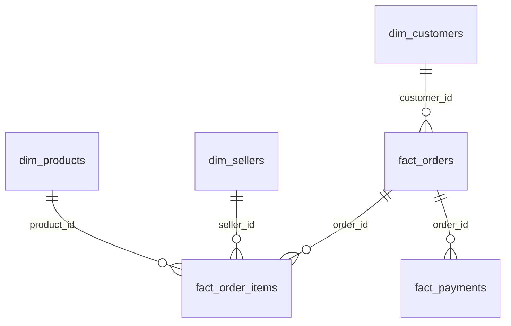

# 📊 Power BI & Tableau Implementation Guide
## Amazon Brazil E-Commerce Business Case

This guide outlines how to build an executive-ready Business Analyst dashboard in **Power BI** or **Tableau** using the clean star-schema datasets exported in the `powerbi_data/` folder.

---

### 1. Data Model (Star Schema)

Import the CSV files located in [`powerbi_data/`](file:///c:/Users/RSDSOffice/Cursor_Projects/Business_Analyst_Preparation/powerbi_data/) and configure the following one-to-many (`1:*`) relationships:



- **`dim_customers`** (1) $\rightarrow$ **`fact_orders`** (*) on `customer_id`
- **`dim_products`** (1) $\rightarrow$ **`fact_order_items`** (*) on `product_id`
- **`dim_sellers`** (1) $\rightarrow$ **`fact_order_items`** (*) on `seller_id`
- **`fact_orders`** (1) $\rightarrow$ **`fact_order_items`** (*) on `order_id`
- **`fact_orders`** (1) $\rightarrow$ **`fact_payments`** (*) on `order_id`

---

### 2. Core DAX Measures (Power BI)

Create a dedicated `_Measures` table and add these formulas:

#### **A. Financial Metrics**
```dax
// Total Gross Merchandise Value (GMV)
Total GMV = SUM(fact_order_items[price])

// Total Freight Revenue
Total Freight = SUM(fact_order_items[freight_value])

// Total Orders
Total Orders = DISTINCTCOUNT(fact_orders[order_id])

// Average Order Value (AOV)
AOV = DIVIDE([Total GMV], [Total Orders], 0)
```

#### **B. Customer & Retention Metrics**
```dax
// Total Unique Shoppers
Unique Customers = DISTINCTCOUNT(dim_customers[customer_unique_id])

// Repeat Buyers (Placed > 1 Order)
Repeat Customers = 
COUNTROWS(
    FILTER(
        VALUES(dim_customers[customer_unique_id]),
        CALCULATE(DISTINCTCOUNT(fact_orders[order_id])) > 1
    )
)

// Repeat Purchase Rate (%)
Repeat Purchase Rate = DIVIDE([Repeat Customers], [Unique Customers], 0)
```

#### **C. Time-Intelligence (MoM Growth)**
```dax
// Previous Month GMV
GMV Previous Month = 
CALCULATE(
    [Total GMV],
    PREVIOUSMONTH(fact_orders[order_purchase_timestamp])
)

// Month-over-Month Growth %
MoM GMV Growth % = 
DIVIDE([Total GMV] - [GMV Previous Month], [GMV Previous Month], 0)
```

---

### 3. Recommended 3-Page Dashboard Layout

#### **Page 1: Executive Overview & Growth**
- **Top Row KPI Cards:** Total GMV (R$ 13.59M), Total Orders (99.4K), AOV (R$ 136.7), Repeat Rate (3.1%).
- **Main Visual (Combo Line & Column Chart):** Monthly GMV on left axis + MoM Growth % on right axis.
- **Side Visual (Donut Chart):** Seasonality breakdown (Spring, Summer, Autumn, Winter).
- **Filters/Slicers:** Date Range Slider, Order Status filter (`delivered`).

#### **Page 2: Customer Retention & Behavior**
- **Visual 1 (Donut / Bar Chart):** Customer Segment breakdown (`New (1 order)`: 96.9%, `Returning (2-4)`: 3.0%, `Loyal (5+)`: 0.1%).
- **Visual 2 (Scatter Plot):** Average Spend vs Purchase Frequency per Customer.
- **Visual 3 (Table / Matrix):** Top 20 VIP Customers ranked by total spend with zip code location.

#### **Page 3: Product Portfolio & Payment Mix**
- **Visual 1 (Horizontal Bar Chart):** Top 10 Product Categories by Revenue (`beleza_saude`, `relogios_presentes`, `cama_mesa_banho`).
- **Visual 2 (100% Stacked Bar Chart):** Payment Method by Basket Value Segment (`Low < R$200`, `Medium R$200-R$1000`, `High > R$1000`).
- **Visual 3 (Box Plot / Min-Max Bar):** Category Price Spread (Price Dispersion).

---

### 4. How to Refresh or Add Data
Whenever you want to re-generate the CSV data, simply run:
```powershell
python export_powerbi_data.py
```
And click **Refresh** in Power BI / Tableau!
