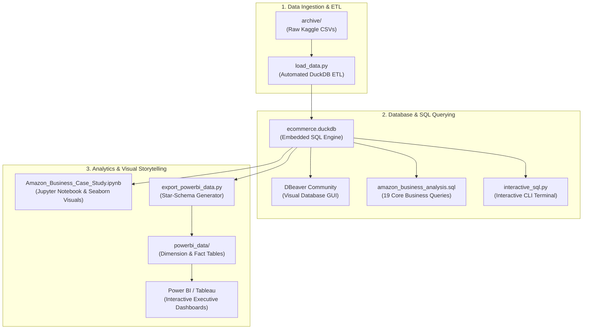

# 🛒 E-Commerce Commercial Analytics & Retention Strategy
> **End-to-End Multi-Tool Business Intelligence Case Study on 100,000+ Marketplace Transactions**

[](#)
[](#)
[](#)
[](#)
[](#)

---

## 🎯 Skills & Technology Toolkit Demonstrated

This project demonstrates versatility across the **entire Business Analyst & Data Analyst toolkit**, from database engineering to visual storytelling:



| Skill Domain | Tools & Technologies | Specific Capabilities Demonstrated |
| :--- | :--- | :--- |
| **SQL & Database Management** | **PostgreSQL Dialect, DuckDB, DBeaver** | Window Functions (`LAG`, `RANK`, `SUM() OVER`), CTEs, Date Truncations, Ingestion, DDL/DML, Schema Design. |
| **Data Engineering / ETL** | **Python, Pandas** | Automated data ingestion pipelines, CSV to database ETL, Star-Schema dimensional modeling. |
| **Exploratory Data Analysis** | **Jupyter Notebook (`.ipynb`), Seaborn, Matplotlib** | Time-series trend analysis, customer segmentation, retention cohort breakdown, donut & bar charts. |
| **Business Intelligence (BI)** | **Power BI, Tableau, DAX** | Star-Schema dimensional modeling, `1:*` relationships, DAX measures (`GMV`, `AOV`, `Repeat Rate`, `MoM Growth`). |
| **Executive Communication** | **Markdown, PDF Business Briefs** | C-suite narrative, STAR method case study, strategic recommendations. |

---

## 📂 Project Structure & Folder Guide

```
Business_Analyst_Preparation/
├── 📁 archive/                       # Raw source datasets (Kaggle Olist 100k+ rows)
├── 📁 powerbi_data/                  # Curated Star-Schema CSVs for Power BI / Tableau
│   ├── fact_orders.csv               # Order timestamps and statuses
│   ├── fact_order_items.csv          # Item prices, freight, seller IDs
│   ├── fact_payments.csv             # Payment types, installments, and values
│   ├── dim_customers.csv             # Unique customer IDs and zip codes
│   ├── dim_products.csv              # Product categories and dimensions
│   ├── dim_sellers.csv               # Seller IDs and locations
│   └── kpi_monthly_summary.csv       # Pre-aggregated monthly financial KPIs
├── 📄 Amazon_Business_Case_Study.ipynb # Full Jupyter Notebook with SQL + Charts + Business Narrative
├── 📄 POWERBI_TABLEAU_GUIDE.md       # Complete Power BI implementation guide with DAX formulas & layout
├── 📄 EXECUTIVE_PORTFOLIO_CASE_STUDY.md # 1-Page executive brief for hiring managers & recruiters
├── 📄 amazon_business_analysis.sql   # Complete SQL script (19 queries across 3 analytical tiers)
├── 📄 load_data.py                   # Python ETL script to load raw CSVs into DuckDB
├── 📄 run_analysis.py                # Automated SQL query execution & validation script
├── 📄 interactive_sql.py             # Live interactive command-line SQL terminal
├── 📄 export_powerbi_data.py         # Script that transforms DuckDB tables into Star-Schema CSVs
├── 📄 ecommerce.duckdb               # Local DuckDB database file (instant zero-setup SQL engine)
└── 📄 Amazon_SQL_Analysis_Report.pdf # Formal analytical PDF report
```

### Detailed Breakdown of Key Folders & Files:

#### 1. `archive/` (Raw Data Source)
Contains the 9 raw CSV files from the Kaggle Brazilian E-Commerce dataset (Orders, Order Items, Customers, Payments, Products, Sellers, Geolocation, Reviews, and Category Translations).

#### 2. `ecommerce.duckdb` & `load_data.py` (Embedded Database Layer)
- **`load_data.py`**: Automated ETL script that loads raw CSVs into DuckDB under the `amazon_brazil` schema in under 2 seconds.
- **`ecommerce.duckdb`**: Standalone SQL database file requiring zero background servers. Can be connected directly to **DBeaver** or queried via Python.

#### 3. `amazon_business_analysis.sql` & SQL Runners
- **`amazon_business_analysis.sql`**: 19 business questions categorized into:
  - *Part I: Baseline Metrics & Data Quality Auditing*
  - *Part II: Customer Segmentation & Category Analysis*
  - *Part III: Advanced Window Functions, MoM Growth & Customer Ranking*
- **`interactive_sql.py`**: An interactive terminal for ad-hoc querying.
- **`run_analysis.py`**: Script to execute and test core queries against the database.

#### 4. `Amazon_Business_Case_Study.ipynb` (Jupyter Notebook Analysis)
Combines SQL querying via DuckDB, Pandas data processing, and publication-ready Seaborn/Matplotlib charts with C-Suite business commentary.

#### 5. `powerbi_data/` & `POWERBI_TABLEAU_GUIDE.md` (Enterprise BI Layer)
- **`powerbi_data/`**: Clean Star-Schema fact and dimension tables generated by `export_powerbi_data.py`.
- **`POWERBI_TABLEAU_GUIDE.md`**: Complete enterprise dashboard blueprint containing table relationships, DAX measures, and 3-page visual mockups.

#### 6. `EXECUTIVE_PORTFOLIO_CASE_STUDY.md` (Hiring Manager Brief)
A concise, 1-page executive summary formatted using the STAR methodology for hiring managers and recruiters.

---

## 🔍 Key Business Insights

```
+------------------------------------------------------------------------------------+
|  Total GMV: R$ 13.59M  |  Total Orders: 99,441  |  AOV: R$ 136.70  |  Repeat Rate: 3.1%  |
+------------------------------------------------------------------------------------+
```

1. **The Retention Deficit:** **96.9%** of customers are one-time purchasers. Only 3.1% return for repeat orders, indicating a high-CAC "leaky bucket" acquisition model.
2. **Payment Channel Dominance:** **Credit Cards** account for **73.9%** of orders with the highest AOV (R$ 163.30), while **Boleto (19.0%)** introduces operational settlement latency.
3. **Category Concentration:** Top 5 categories (*Health & Beauty, Watches, Bed/Bath, Sports, Computers*) drive **>35%** of gross merchandise value.
4. **Q4 Seasonality:** Strong Q4 spike with November Black Friday driving a +56% Month-over-Month revenue surge.

---

## 🚀 How to Run Locally

### 1. Re-Ingest Data (Optional)
```powershell
python load_data.py
```

### 2. Run Interactive SQL Terminal
```powershell
python interactive_sql.py
```

### 3. Open DBeaver GUI
Connect DBeaver to `ecommerce.duckdb` and execute queries directly in the SQL editor.

### 4. Open the Jupyter Notebook
Open [`Amazon_Business_Case_Study.ipynb`](./Amazon_Business_Case_Study.ipynb) in VS Code / Cursor or JupyterLab.

### 5. Build Power BI Dashboards
Import files from [`powerbi_data/`](./powerbi_data/) into Power BI Desktop following [`POWERBI_TABLEAU_GUIDE.md`](./POWERBI_TABLEAU_GUIDE.md).
